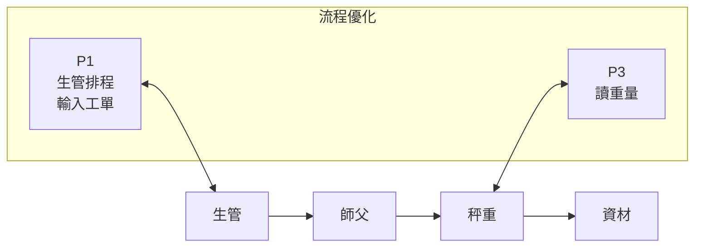
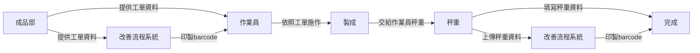
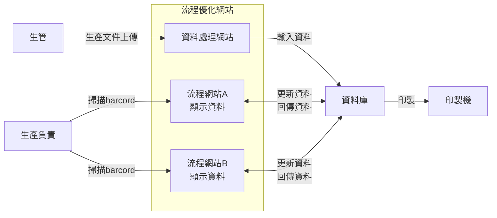

# OptimizationFlow
- **author:`Eric`**

## 原本流程()


## 需求流程(擬定)


## 需求流程(擬定)


* 待確認
1. 最初的工單如何交付
2. 確認工單加入流程
3. 確認製作品項的種類，以便數量換算
4. 確認重量單位
5. 確認工單上資料"HSF"
* 11/11上午9點在上達
1. 確認秤重的方式
2. RS232接收
## 技術流程



## 資料表
|欄位名稱|型態|Null|限制|說明|備註|範例|初始批次匯入|條碼輸入|
|-|-|-|-|-|-|-|-|-|
|date|TIMESTAMP|N||日期|電腦日期|2024/11/7|V
|productionUnit|VARCHAR(20)|N||生產單位||MM523|V
|carPlatform|VARCHAR(20)|N||車台||B01|V
|process|INT|N||工序||10|V
|carModification|VARCHAR(20)|N||改車人員||002402|V
|carAttendant|VARCHAR(20)|N||顧車人員||002402|V
|unitWeight|FLOAT(10,3)|Y||單重|輸入品名、車台編號自動帶入|370||
|netWeight|FLOAT(10,3)|Y||淨重|磅秤輸入|||V
|quantity|INT|Y||數量|換算自動帶入|||
|operator|VARCHAR(20)|N||作業員||003826|V
|boxes|INT|N||箱數||1|V
|continue|VARCHAR(20)|N||後續單位||加工|V
|hsf||Y||HSF|內定HSF，特殊選
|exception|VARCHAR(20)|Y||異常品|有異常再輸入、列印紅字|異常品||V

```
使用說明：換行<br>、直式TD
```
[Markdown 教學](https://gist.github.com/christech1117/6dc5221c177104990767d6490ad8c7ba)

[VScode 套件:Markdown Preview Mermaid Support教學](https://aa333536.pixnet.net/blog/post/119862210)
```
command + k ,v
```

# 開發環境
* Herd(PHP)
* DBngin(MySQL)
* TablePles
* 套件使用
1. 上傳execl
```
composer require phpoffice/phpspreadsheet
```
2. 使用UUID
```
composer require ramsey/uuid
```

# commit 規範
```
Message Header: <type>(<scope>): <subject>
```
*   type（必要）：commit 的類別，如：feat(建立), fix(修改), docs, style, refactor, test, chore
*   scope（可選）：commit 影響的範圍，如：資料庫、控制層、模板層等，視專案不同改變
*   subject（必要）：commit 的簡短描述，不超過 50 個字元，結尾不加句號


# [MySQL](https://note.drx.tw/2012/12/mysql-syntax.html)
```
常用資料庫資料型態
1. INT (整數)
2. CHAR (1~255字元字串)
3. VARCHAR (不超過255字元不定長度字串)
4. TEXT (不定長度字串最多65535字元)
```


## app.py

```
pip install Flask-SQLAlchemy
pip install pymysql
```

## usb_monitor.py
```
pip install Flask pyusb requests
brew install libusb

```
## 發api確認
```
curl -X POST -H "Content-Type: application/json" -d '{"data": "USB input data here"}' http://127.0.0.1:5000/usb_data
```

## python pip 路徑注意事項
```
pip安裝路徑
pip show pip
```

# 建立虛擬環境
python3.8 -m venv .venv

# 啟動 (Linux / macOS)
source .venv/bin/activate

# 離開
deactivate
