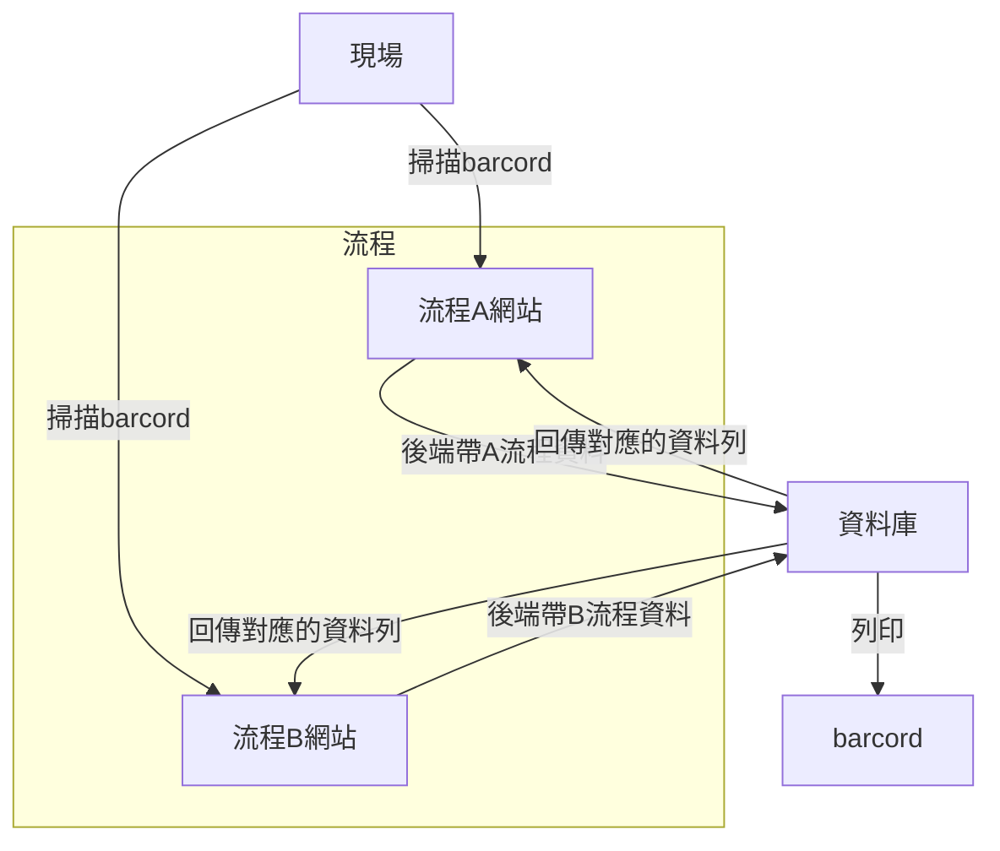

## 需求

## 技術

```
使用說明：換行<br>、直式TD
```
[Markdown 教學](https://gist.github.com/christech1117/6dc5221c177104990767d6490ad8c7ba)
# OptimizationFlow
- **author:`Eric`**


# 開發環境
Herd(PHP)
DBngin(MySQL)TablePles

```
// 上傳execl
composer require phpoffice/phpspreadsheet
// 使用UUID
composer require ramsey/uuid
```

# commit 規範
```
Message Header: <type>(<scope>): <subject>
type（必要）：commit 的類別
如：feat, fix, docs, style, refactor, test, chore
scope（可選）：commit 影響的範圍
如：資料庫、控制層、模板層等，視專案不同改變
subject（必要）：commit 的簡短描述
不超過 50 個字元
結尾不加句號
盡量讓 Commit 單一化，一次只更動一個主題
```

[MySQL](https://note.drx.tw/2012/12/mysql-syntax.html)
```
常用資料庫資料型態
1. INT (整數)
2. CHAR (1~255字元字串)
3. VARCHAR (不超過255字元不定長度字串)
4. TEXT (不定長度字串最多65535字元)
```
